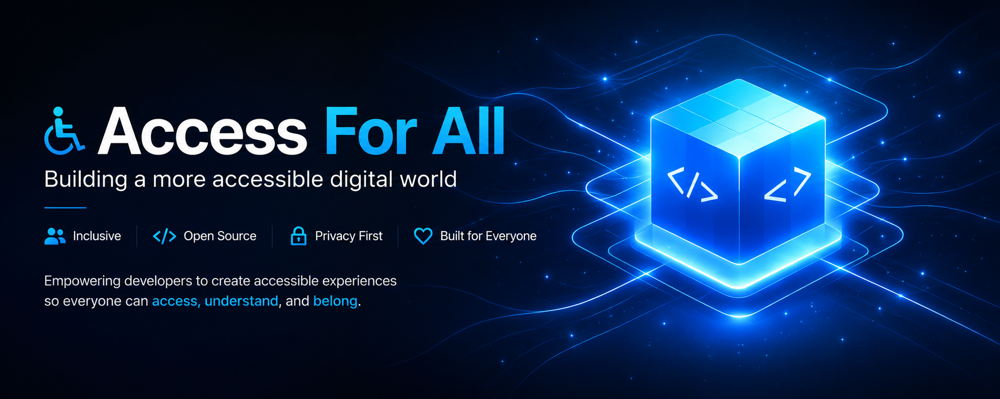

# Access for All



> A self-contained accessibility runtime built to help reopen digital doors that checkbox accessibility has quietly closed.

Access for All is an MIT-licensed accessibility engine that runs inside the page itself.

It is not a static-site concept, not a framework package, and not an overlay that tries to patch a finished product from the outside. It is a runtime preference system that writes live state to the root document, updates rendering immediately, and gives people real control over how a digital surface behaves for them.

It is built for teams who want accessibility to be part of the interface itself:

- real runtime controls, not a compliance badge
- real user preference combinations, not one-size-fits-all modes
- real portability across websites, apps, portals, kiosks, and digital services

## The Pitch

Access for All gives people the power to reshape a digital interface around their own needs while keeping the product intact.

Instead of replacing the experience, it adapts the experience. Instead of asking people to accept whatever the browser, device, or operating system happens to offer, it brings a consistent accessibility control layer directly into the product.

## Why This Exists

Many digital doors have been closed again.

Tick-box accessibility has helped create a world where websites, sign-in flows, kiosks, booking journeys, forms, customer portals, and other public digital interactions are called accessible while still shutting people out in practice.

Passing a check is not the same as being workable.

Access for All exists to push back on that.

The goal is simple:

- let people change the interface to suit themselves
- keep those preferences consistent
- make accessibility part of the product, not a post-launch excuse
- reopen digital interactions that have been made needlessly hard to use

## What It Actually Is

The engine reference in this repo defines Access for All as a fully self-contained runtime preference system.

In practice that means:

- it runs entirely inside the webpage
- it writes root `data-*` attributes to `<html>`
- it writes runtime CSS custom properties for numeric controls
- it updates the interface immediately with no page reload
- it does not depend on a framework
- it does not rely on OS accessibility support being present or enabled

This matters because real environments are inconsistent. A polished desktop setup, a locked-down corporate machine, a Linux kiosk, a POS terminal, a browser-only portal, and a public check-in screen do not all offer the same accessibility support. This engine is designed to carry the same control model across those surfaces instead of leaving people at the mercy of the platform.

## Why It Stands Out

Most accessibility tooling falls into one of three traps:

- it is too shallow to make a real difference
- it is too tied to one stack or product type
- it treats users as a checklist category instead of a person with layered needs

Access for All is designed to avoid all three.

## What The Runtime Controls

Access for All already supports:

- appearance controls: default, light, dark
- palette controls: monochrome and colour remapping modes
- contrast controls: multiple lower and higher contrast steps
- text controls: font size, line spacing, paragraph spacing, letter spacing, word spacing
- font controls: site font, hyperlegible, dyslexia-friendly, system sans
- comfort controls: motion reduction, transparency reduction, depth reduction, visual filters
- reading controls: focused reading mode and reading guide
- orientation controls: stronger focus states, clearer links, landmark highlighting
- media controls: image and media dimming to reduce glare and noise
- talkback controls: spoken support and page read-aloud where the browser supports it
- persistence: saved local state so the experience stays consistent across pages

## The Core Principle

Every axis works independently and in conjunction with every other axis.

That is one of the most important parts of the engine. A person does not arrive with one neat accessibility label. Someone may need darker presentation, stronger contrast, calmer motion, wider spacing, and a dyslexia-friendly font at the same time. Access for All treats that combination as valid, intentional, and fully supported.

The runtime does not suppress combinations because they look unusual. If a person chooses dark mode, a yellow palette, stronger contrast, and a warm filter, the engine is expected to honour that exact configuration.

## Built In, Not Bolted On

On the live BaseLayer Digital site, the engine is positioned as something built into the structure rather than retrofitted afterwards. That same model carries into this repo.

This is not meant to sit apart from the product. It is meant to live inside the interface itself:

- the controls are part of the real UI
- the layout, tokens, and components respond together
- the person keeps the same page, just adapted to their needs
- the runtime can be extended instead of fought

## Bigger Than One Website

Access for All should be understood as an engine model, not just a starter repo.

The same runtime idea can be built on and carried into:

- websites
- web apps
- customer portals
- internal tools
- booking systems
- kiosk and check-in interfaces
- browser-based service touchpoints
- future desktop, mobile, or hybrid surfaces that need the same accessibility logic

The point is not “static first”. The point is that the runtime can sit on top of and inside any digital surface that can expose a document, state, and interface layer.

## Repo Contents

- [`frontend/index.html`](frontend/index.html): minimal starter page with the engine UI wired in
- [`frontend/pages/demo.html`](frontend/pages/demo.html): proof page for checking the shared runtime visually
- [`frontend/pages/engine.html`](frontend/pages/engine.html): implementation reference for the runtime contract
- [`frontend/scripts/accessibility-engine.js`](frontend/scripts/accessibility-engine.js): state model, runtime writes, persistence, talkback
- [`frontend/scripts/site-ui.js`](frontend/scripts/site-ui.js): modal, drawer, consent UI, and engine form wiring
- [`frontend/styles/`](frontend/styles/): token, layout, component, and accessibility layers

## Quick Start

Serve the frontend locally:

```bash
cd frontend
python3 -m http.server 8080
```

Then open `http://localhost:8080`.

## Why Teams Can Build On This

- No framework dependency
- No page reload needed for state changes
- Clear runtime contract through root `data-*` attributes and CSS variables
- Public API exposed at `window.accessibilityEngine`
- Demo and reference pages included for implementation and testing
- MIT licensed so the engine can be adopted, extended, and commercialised freely

## Verified In This Repo

- the runtime scripts are present and linked
- active local file references resolve correctly
- the demo and reference pages are wired
- the engine model is documented in the repo itself
- bundled accessibility fonts and notices are included

## Licensing

Project code is released under the [MIT License](LICENSE).

Bundled third-party assets keep their own licenses where required. See [THIRD_PARTY_NOTICES.md](THIRD_PARTY_NOTICES.md).

## GitHub About Line

`Self-contained accessibility runtime for websites, apps, kiosks, and digital services with real user controls for reading, contrast, motion, focus, and comfort.`
